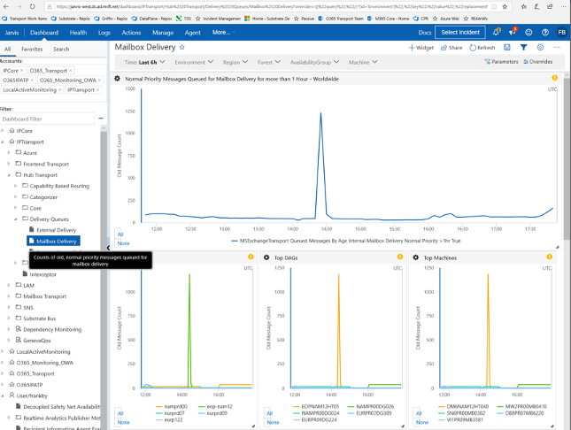

# QMBA-MailboxDelivery-Forest Alert

Monday, September 24, 2018

10:32 AM

------

**Contents**

[What Triggers The Alert](#what-triggers-the-alert)

[Possible Root Causes](#possible-root-causes)

[Diagnose and Recover](#diagnose-and-recover)

------

| Monitor Goal                                                 | Investigation Goal                                           | Owner   |
| ------------------------------------------------------------ | ------------------------------------------------------------ | ------- |
| Alert when normal priority messages across a forest have been queued for mailbox delivery for too long. | Messages queued for mailbox delivery will likely be dispersed across the entire forest. Attempt to find out why the old ones cannot be delivered to a mailbox or de-prioritized | frankby |

## What Triggers The Alert?

This signal for this alert is generated by using **MailboxDeliveryQmbaProbe**, which periodically measures the value of the MSExchangeTransport Queued Messages By Age / Internal Mailbox Delivery Normal Priority / \>1hr performance counter and uploads its value to Geneva. The alert **forest-level** threshold is 1000.

A **Geneva dashboard** (which provides current and recent historical views of this data by time, forest, and group availability) is accessible on the **IPTransport** account. There is also a **link** at the bottom of the Alert e-mail.

[QMBA dash board link](https://jarvis-west.dc.ad.msft.net/dashboard/share/91E7368C?overrides=%5b%7b%22query%22:%22//*%5bid='Environment'%5d%22,%22key%22:%22value%22,%22replacement%22:%22%22%7d,%7b%22query%22:%22//*%5bid='Region'%5d%22,%22key%22:%22value%22,%22replacement%22:%22%22%7d,%7b%22query%22:%22//*%5bid='Forest'%5d%22,%22key%22:%22value%22,%22replacement%22:%22%22%7d,%7b%22query%22:%22//*%5bid='AvailabilityGroup'%5d%22,%22key%22:%22value%22,%22replacement%22:%22%22%7d,%7b%22query%22:%22//*%5bid='Machine'%5d%22,%22key%22:%22value%22,%22replacement%22:%22%22%7d%5d%20)

## Possible Root Causes

1.  **Hot delivery, single delivery server has an issue.**  
    All queued messages target the same delivery server.

2.  **Hot hub, single hub server cannot send messages; probable Auth issue.**  
    All queued messages are in the same hub server.

3.  **Scattered hub and scattered delivery.**  
    Some  messages have  patterns queued.

4.  **Networking failure, café failure**.

## Diagnose and Recover

1.  Once you receive an alert, open the [QMBA dash board link](https://jarvis-west.dc.ad.msft.net/dashboard/share/91E7368C?overrides=%5b%7b%22query%22:%22//*%5bid='Environment'%5d%22,%22key%22:%22value%22,%22replacement%22:%22%22%7d,%7b%22query%22:%22//*%5bid='Region'%5d%22,%22key%22:%22value%22,%22replacement%22:%22%22%7d,%7b%22query%22:%22//*%5bid='Forest'%5d%22,%22key%22:%22value%22,%22replacement%22:%22%22%7d,%7b%22query%22:%22//*%5bid='AvailabilityGroup'%5d%22,%22key%22:%22value%22,%22replacement%22:%22%22%7d,%7b%22query%22:%22//*%5bid='Machine'%5d%22,%22key%22:%22value%22,%22replacement%22:%22%22%7d%5d%20) to get the latest queue status. Change this alert urgency to **Sev3**  while you are investigating.

2.  Run Transport on-call script **`Diagnose-QRBA.ps1`**.

    a.  If the script points to a single delivery server, remove the mailbox database for that delivery server.

    b.  Run **`check-deliveryhealth.sp1`**, in the \"MDB Health Summary\" session.
     If the a mdb\'s **MDBHealth** is low and **WorestREsource** is DiskLatency - **contact the HA team**. During the **MDB Throttling Summary** session, if many messages are throttled by Disklatency - **contact the HA team**.

    c. Check the **delivery server provision status**, to see if delivery server is in MM - but  still has mdb mounted.

    d.  You can refer this playbook ([HttpDeliveryAvailabilityV2Monitor](onenote:#HttpDeliveryAvailabilityV2Monitor&section-id={F0A9DD2C-8D88-4246-9561-12B4E91CFA0A}&page-id={AF6CA10D-662C-41AA-B2F0-6E94B741AFAC}&end&base-path=https://microsoft.sharepoint-df.com/teams/O365TransportTeam/SiteAssets/O365%20Transport%20Team%20Notebook/Alert%20Playbook.one)) to diagnose single delivery issue.

3. **`Diagnose-QRBA.ps1` ** **cannot run** in an **ITAR** environment. **Contact Escort**  to run the following commands to locate the hot delivery server:

   `Get-QueueDiversityV2 -forest //It will list top target mdb-\> \$mdbGuid`

   `Get-MailboxDatabase \$mdbGuid //Find where this mdb mounted`

4. Check the Geneva dashboard **Top Machines** chart (which is the top queued hub server). If top machine queued message count is close to forest queued messages count, this is a hot hub issue.

   a.  Review last error of queue messages to know why messages were deferred in the delivery queue.

   `$q = get-queue -Server BN3PR00MB0178 -Filter \"DeliveryType -eq \'HttpDeliveryToExo`

   `$msg= get-message -Queue \$q.Identity`

   `$msg.LastError`

   b.  Download **`HubTransportHttpSendLogsHourly`** in hub server to check for more details.

   `Get-MachineLog -target \$server -Log HubTransportHttpSendLogsHourly`

   c.  Restart **`MSExchangeTransport`** to mitigate first.

   `Request-RestartService_V2.ps1 **-Target** \$server **-ServiceName**` 

   `MSExchangeTransport **-Reason** \"reason\"`

5. If not hot delivery or hot hub.

   Some special messages may have patterns queued.

   a.  Check messages in the delivery queue.  
Check the last error to see if queued messages have patterns .
   
`Get-QueueDiversityV2 -Forest -Priority normal -QueueFilter {DeliveryType -eq \'HttpDeliveryToExo\'} -MinMessageLatency \"01:00:00\"`
   
b.  Check delivery [hang dashboard](<https://jarvis-west.dc.ad.msft.net/dashboard/O365_Transport/MailboxTransport/Delivery/DeliveryHangException>), to see in the alerting forest delivery hang status. If hang exception increases a lot, it may cause other normal messages to queue. 
   
   Contact another team based on hang call stack. Mitigation maybe drop messages that cause the delivery to hang.
   
   Check the **message id** to find message-common patterns.
